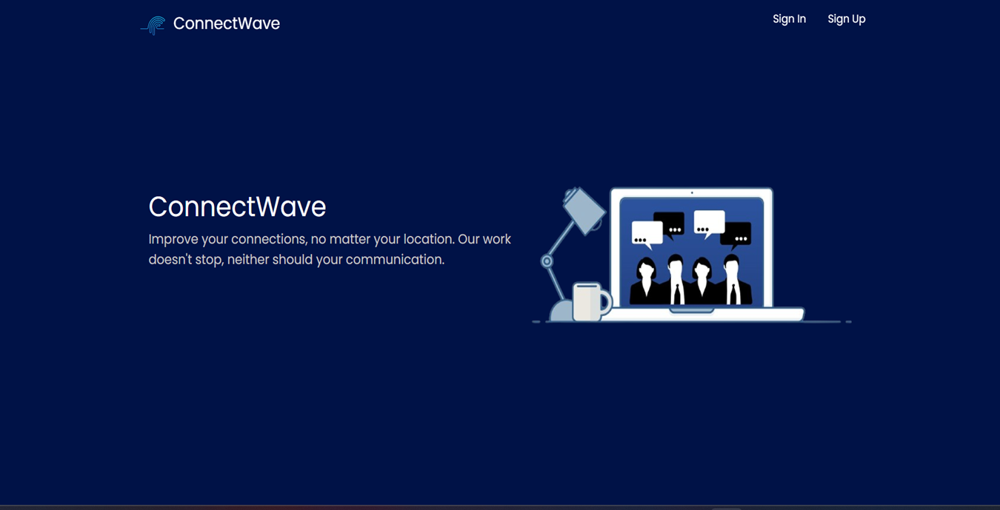
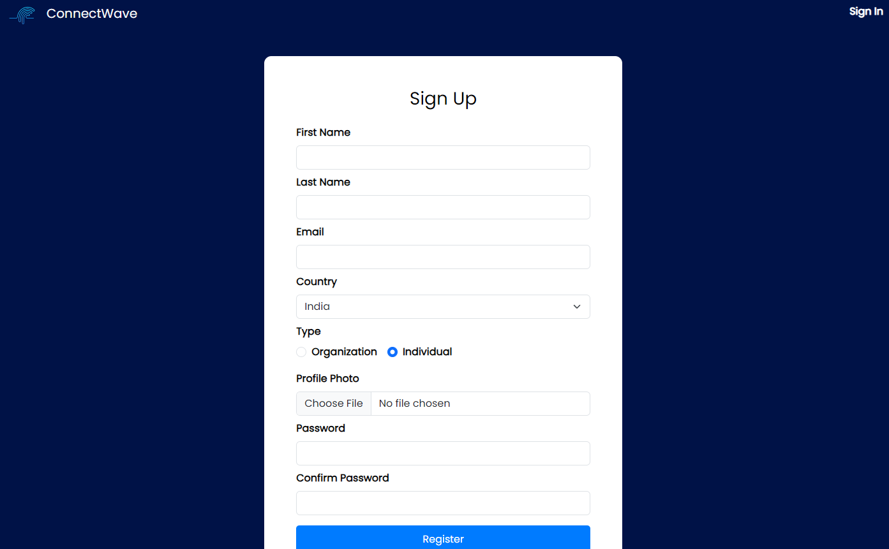
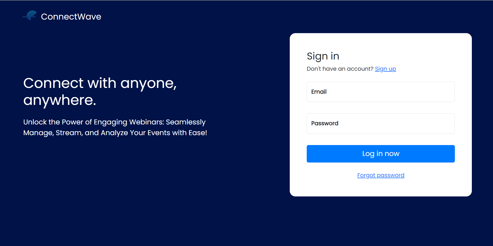
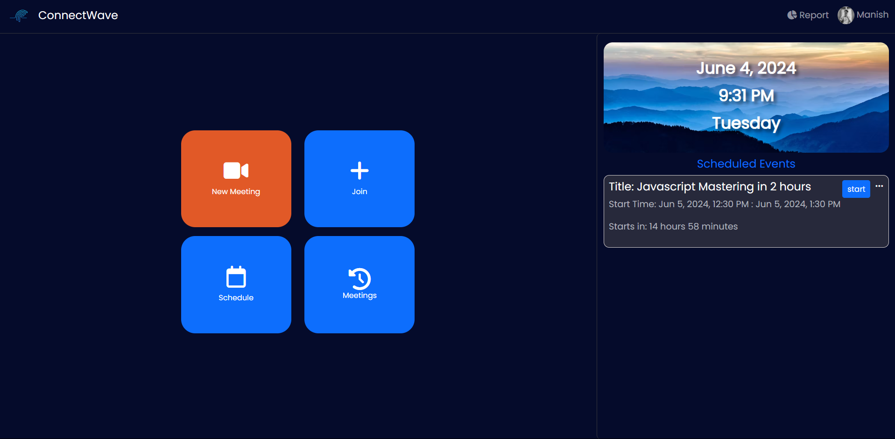
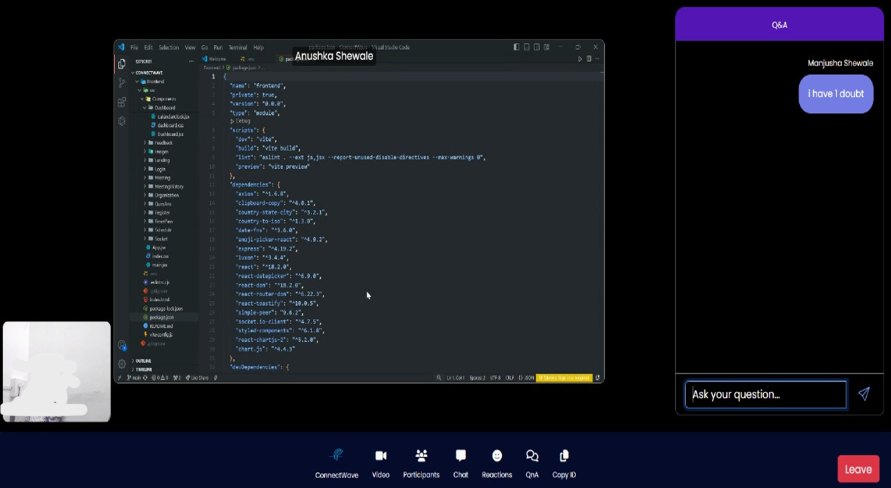

# ConnectWave: Your Ultimate Online Webinar Solution

### A Real-Time, Interactive Webinar Experience

**ConnectWave** is a cutting-edge webinar platform designed to deliver an unparalleled virtual experience using the MERN stack (MongoDB, Express.js, React.js, and Node.js). Seamlessly combining high-definition audio and video with interactive features, ConnectWave is tailored for collaboration, engagement, and effective communication.

## Key Features

* **Exceptional Audio and Video Quality:** Experience crystal-clear sound and stunning visuals that elevate your webinars to a professional level.
* **Effortless Scheduling and Joining:** Navigate our intuitive interface for quick and easy webinar scheduling and participation.
* **Instant Screen Sharing:** Enhance your presentations with real-time screen sharing, enabling seamless collaboration and interaction.
* **On-Demand Recording:** Record webinars effortlessly for future reference or sharing with attendees who couldn’t join live.
* **Engagement Tools:** Foster lively discussions with real-time chat, emoji reactions, and dynamic Q&A sessions that keep participants engaged.

## Technologies Used

* **Frontend:** React.js (Vite)
* **Backend:** Node.js, Express.js
* **Database:** MongoDB
* **Real-Time Communication:** Socket.IO, WebRTC

## Getting Started

### Prerequisites

* **Node.js and npm:** Ensure Node.js and npm (Node Package Manager) are installed. Get them from [Node.js](https://nodejs.org/).
* **MongoDB:** Install and run MongoDB by downloading it from [MongoDB](https://www.mongodb.com/).
* **Git:** For version control, install Git from [Git](https://git-scm.com/).

### Clone the Repository

```bash
git clone https://github.com/manish0732/ConnectWave
```

### Set Up Environment Variables

* **Backend (.env file):** Create a `.env` file in the root directory of the backend folder and add the following variables, replacing placeholders with your actual values:
```
MONGO_URI=YOUR_MONGO_URI
PORT=8000
SECRET=Your_Secret
EMAIL=Your_Email_FOR_SENDING_EMAILS
PASS=EMAIL_UNIQUE_PASS
```
* **Frontend (.env file):** Create a `.env` file in the root directory of the frontend folder and add:
```
VITE_API_URL='your_backend_url'
```

### Install Dependencies

```bash
# Navigate to the backend directory
cd Backend

# Install backend dependencies
npm install

# Navigate to the frontend directory
cd Frontend

# Install frontend dependencies
npm install
```

### Run the Project

* **Backend:**
   ```bash
   npm start
   ```

* **Frontend:**
   ```bash
   npm run dev
   ```

### Screenshots







## Authors
- [Anushka Shewale](https://github.com/anushkas1204/)
- [Manish Joshi](https://github.com/Manish0732/)
 

## Support

For inquiries, issues, or support, reach out at [anushkashewale9359@gmail.com](mailto:anushkashewale9359@gmail.com) or open an issue on our GitHub repository
